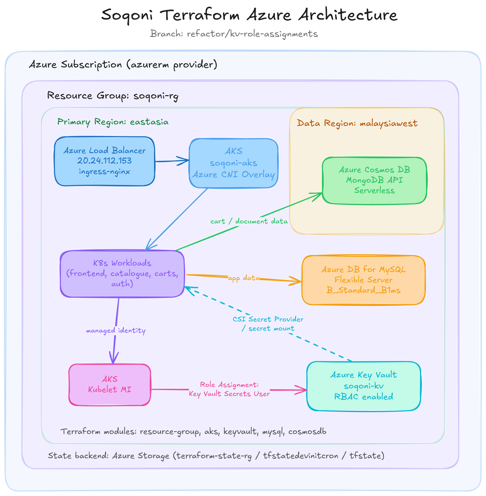

<p align="center">
  
  
  
  
</p>

# soqoni-terraform


[Terraform ≥ 1.5](https://developer.hashicorp.com/terraform/install) IaC for the Soqoni microservices platform on Azure. Manages the AKS cluster and supporting infrastructure as versioned, reproducible code.

<!-- TODO: architecture diagram showing Azure resource hierarchy:
     Subscription → soqoni-rg → [AKS, MySQL Flexible Server, Cosmos DB, Key Vault]
     with terraform module labels on each resource box
     Suggested file: docs/azure-infra.png -->
<p align="center">
  
</p>

## Modules

| Module | Resource | Status |
|--------|----------|--------|
| `modules/resource-group` | `soqoni-rg` (eastasia) | ✅ Imported |
| `modules/aks` | `soqoni-aks` — Standard_B2s, k8s 1.34, Key Vault CSI addon | ✅ Imported |
| `modules/mysql` | Azure MySQL Flexible Server | 🔜 Planned |
| `modules/cosmos` | Azure Cosmos DB (MongoDB API, serverless) | 🔜 Planned |
| `modules/keyvault` | Azure Key Vault + role assignments | 🔜 Planned |

State is stored remotely in Azure Blob Storage (`tfstatedevinitcron/tfstate/soqoni/soqoni.tfstate`). No state file in this repo.

## Setup

```bash
# 1. Clone and enter the repo
git clone https://github.com/abdvswmdr/soqoni-terraform
cd soqoni-terraform

# 2. Create terraform.tfvars (gitignored — never commit this)
cat > terraform.tfvars <<EOF
subscription_id = "<your-subscription-id>"
ssh_public_key  = "<contents of ~/.ssh/id_ed25519.pub>"
EOF

# 3. Initialise — downloads provider, connects to remote backend
terraform init

# 4. Preview changes
terraform plan

# 5. Apply
terraform apply
```

## Structure

```
soqoni-terraform/
  providers.tf          # azurerm ~> 4.0, remote backend config
  variables.tf          # input variables with defaults
  outputs.tf            # cluster name, kubelet identity, kubectl command
  main.tf               # module calls
  terraform.tfvars      # ← gitignored (subscription_id, ssh_public_key)
  modules/
    resource-group/     # azurerm_resource_group
    aks/                # azurerm_kubernetes_cluster (SystemAssigned identity, KV CSI addon)
```

## Outputs

| Output | Value |
|--------|-------|
| `aks_cluster_name` | `soqoni-aks` |
| `aks_kubelet_identity` | Object ID of the kubelet managed identity (used for Key Vault role assignments) |
| `aks_get_credentials_cmd` | `az aks get-credentials ...` command ready to copy |
| `resource_group_name` | `soqoni-rg` |

## Workflow

```bash
# Verify no drift after manual Azure changes
terraform plan

# Make a change (e.g. increase node count in variables.tf)
# then preview and apply
terraform plan
terraform apply

# Check what Terraform currently knows about a resource
terraform state show module.aks.azurerm_kubernetes_cluster.this

# Tear down everything (⚠ destructive — deletes live AKS)
terraform destroy
```

## State Backend

Remote state lives in an existing Azure Storage Account — bootstrapped once manually, never managed by Terraform (avoids the chicken-and-egg problem):

| Property | Value |
|----------|-------|
| Resource group | `terraform-state-rg` |
| Storage account | `tfstatedevinitcron` |
| Container | `tfstate` |
| Key | `soqoni/soqoni.tfstate` |

State is locked via Azure Blob lease during applies (safe concurrent use).

## Notes

- **Import pattern** — existing Azure resources were adopted via `import {}` blocks (Terraform 1.5+) rather than recreated. Import blocks were removed after the first successful apply.
- **`lifecycle.ignore_changes`** — `linux_profile[0].ssh_key[0].key_data` is ignored because the azurerm provider normalizes the SSH key string differently from how Azure stores it, causing false drift detection.
- **`terraform.tfvars` is gitignored** — contains subscription ID and SSH public key. These are set locally or via `TF_VAR_` environment variables in CI.

## License

[GNU General Public License v3.0](LICENSE)
